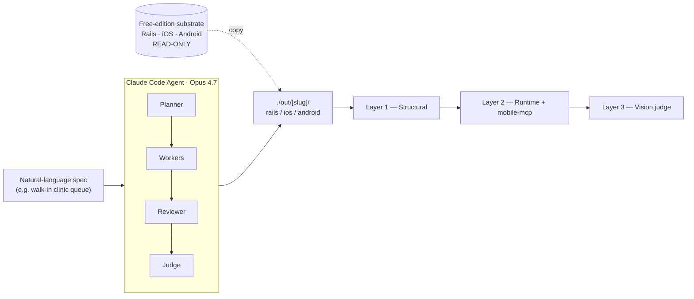

# NativeAppTemplate Agent

A Claude Code agent that turns a natural-language spec — something as informal as `"a walk-in queue for a barbershop"` — into a working three-platform implementation:

- **Rails 8.1 API**
- **native SwiftUI iOS**
- **native Jetpack Compose Android**

Coherent across all three, in under an hour.

> **Status:** Hackathon build. Developed during [Built with Opus 4.7: a Claude Code Hackathon](https://cerebralvalley.ai/e/built-with-4-7-hackathon) (April 21–27, 2026). Active development in progress — expect breaking changes through the end of April.

---

## Why this exists

Most "AI builds an app" tools stop at a single web frontend. The real pain for anyone shipping a mobile product is that the *same* domain has to be implemented three times — multi-tenant Rails API, native iOS, native Android — each with its own idioms, and keeping them consistent is where weeks disappear.

Classic mobile boilerplates sell "save 12–16 weeks of setup." AI coding tools have compressed that value to 2–3 weeks of AI-assisted work. The durable problem that remains — even with AI — is **cross-platform coherence**: keeping a Rails API, a native iOS client, and a native Android client all consistent under iteration, with no contract drift, no forgotten rename, no divergent localized copy.

This agent is an answer to that: turn a boilerplate into a generator that produces coherent three-platform implementations on demand, with structural and semantic validation built in.

## What it does

Point the agent at a natural-language spec:

```
a walk-in clinic queue for small veterinary practices
```

It will:

1. **Parse the spec** into a structured domain (entities, fields, relationships, state machines).
2. **Copy the free-edition substrate** (three MIT-licensed repos covering Rails + iOS + Android) into `./out/<spec-slug>/{rails,ios,android}/`.
3. **Rename the skeleton** — `Shop → Clinic`, `Shopkeeper → Vet`, etc. — consistently across Ruby migrations, Swift models, Kotlin data classes, policies, tests, and localized copy.
4. **Adapt or replace the domain module** — keep `ItemTag` for walk-in queue variants; strip and insert a new resource for non-queue SaaS.
5. **Drive the build green** — `bin/rails test`, `xcodebuild test`, `./gradlew test` must all pass before the agent exits.
6. **Validate the output** across three layers (structural, runtime, semantic). Details in [`docs/SPEC.md`](./docs/SPEC.md) section 6.

## Demo

*90-second end-to-end run — coming after the hackathon wrap on 2026-04-27.*

## Architecture



## Substrate

The agent operates on the free, MIT-licensed edition of NativeAppTemplate — three public repos:

| Repo | Stack | LOC |
|---|---|---|
| [`nativeapptemplateapi`](https://github.com/nativeapptemplate/nativeapptemplateapi) | Rails 8.1, PostgreSQL, `devise_token_auth`, `pundit`, `acts_as_tenant` | 7,687 (Ruby) |
| [`NativeAppTemplate-Free-iOS`](https://github.com/nativeapptemplate/NativeAppTemplate-Free-iOS) | 100% SwiftUI, `@Observable`, MVVM, Liquid Glass design, iOS 26.2+ | 15,311 (Swift) |
| [`NativeAppTemplate-Free-Android`](https://github.com/nativeapptemplate/NativeAppTemplate-Free-Android) | 100% Kotlin, 100% Jetpack Compose, Hilt, Retrofit2, API 26+ | 19,521 (Kotlin) |

Combined ~42.5k LOC. Extracted from [MyTurnTag Creator](https://myturntag.com), a walk-in queue-management SaaS live on both app stores since 2024.

## Usage (target interface)

> **Not yet functional — hackathon build in progress.** The interface below is the target; `npx` won't work until v0.1 ships at the end of hackathon week.

```bash
# Standalone CLI — must-have for the hackathon demo
npx nativeapptemplate-agent "a walk-in clinic queue for small veterinary practices"

# Stretch specs the agent is also designed to handle
npx nativeapptemplate-agent "a restaurant waitlist for casual dining"
npx nativeapptemplate-agent "a personal task tracker with due dates"

# Generated output appears under ./out/<slug>/
tree ./out/clinic-queue/
# ├── rails/      ← Rails 8.1 API, git-initialized, buildable
# ├── ios/        ← SwiftUI iOS project, buildable
# └── android/    ← Jetpack Compose Android project, buildable
```

The agent will also be available as a Claude Code plugin.

## Requirements

- [Node.js](https://nodejs.org) 22+
- [Claude Agent SDK](https://github.com/anthropics/claude-agent-sdk-typescript) v0.2.111 or later (needed for Opus 4.7)
- An Anthropic API key with access to `claude-opus-4-7`
- Local checkouts of the three substrate repos, referenced via environment variables:
  ```bash
  export NATEMPLATE_API="/path/to/nativeapptemplateapi"
  export NATEMPLATE_IOS="/path/to/NativeAppTemplate-Free-iOS"
  export NATEMPLATE_ANDROID="/path/to/NativeAppTemplate-Free-Android"
  ```
- For runtime validation (Layer 2 onwards): Xcode 26.3+ with iOS 26.2+ simulator, Android SDK with API 26+ emulator
- For UI automation: [`mobile-next/mobile-mcp`](https://github.com/mobile-next/mobile-mcp) (installed automatically as a Claude Code MCP server)

## Validation (three layers)

The agent doesn't just generate code and exit — it validates the output.

1. **Structural.** `ripgrep` for leftover domain tokens; OpenAPI contract parity check between Rails, iOS networking, and Android repository layers. A silent rename inconsistency fails the run before any tests execute.
2. **Runtime.** Boot the generated Rails server; build and launch iOS and Android apps; drive a scripted CRUD scenario via [`mobile-next/mobile-mcp`](https://github.com/mobile-next/mobile-mcp). Any 4xx/5xx or unhandled client error fails the run.
3. **Semantic.** Opus 4.7 as judge — scores whether the generated code and rendered UI actually express the intended domain. Vision judges read simulator/emulator screenshots directly.

See [`docs/SPEC.md`](./docs/SPEC.md) for the full design.

## Project docs

- [`docs/SPEC.md`](./docs/SPEC.md) — full technical specification
- [`ROADMAP.md`](./ROADMAP.md) — where this project is headed, OSS vs hosted, what stays out of scope
- [`CLAUDE.md`](./CLAUDE.md) — Claude Code project instructions (read if you're running Claude Code against this repo)

## Contributing

During hackathon week (April 21–27, 2026) the repository moves quickly and breaking changes are expected. After that, contributions are welcome via standard GitHub issues and PRs. A `CONTRIBUTING.md` with detailed guidelines will land once the hackathon dust settles.

If you spot something broken before then, feel free to open an issue — just don't be surprised if the fix lands as part of a larger rewrite.

## License

MIT. See [`LICENSE`](./LICENSE).

## Acknowledgments

- [Anthropic](https://www.anthropic.com) for Claude Opus 4.7 and Claude Code
- [Cerebral Valley](https://cerebralvalley.ai) for running the hackathon
- [`mobile-next/mobile-mcp`](https://github.com/mobile-next/mobile-mcp) for making mobile UI automation actually workable from an agent
- [MyTurnTag Creator](https://myturntag.com) users, whose real-world queue management taught me which abstractions survive and which don't

---

*Built solo in Tokyo.*
