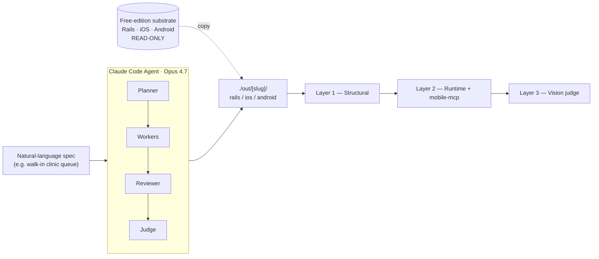

# NativeAppTemplate Agent

A Claude Code agent that turns a natural-language spec — something as informal as `"a walk-in queue for a barbershop"` — into a working three-platform implementation:

- **Rails 8.1 API**
- **native SwiftUI iOS**
- **native Jetpack Compose Android**

Coherent across all three, in under an hour.

[](https://www.npmjs.com/package/nativeapptemplate-agent)
[](https://github.com/nativeapptemplate/nativeapptemplate-agent/actions/workflows/ci.yml)
[](./LICENSE)
[](https://nodejs.org/)

```bash
npx nativeapptemplate-agent "a walk-in clinic queue for small veterinary practices" --project-name="VetClinic"
```

> **Status: 0.2.1 stable.** First built during [Built with Opus 4.7: a Claude Code Hackathon](https://cerebralvalley.ai/e/built-with-4-7-hackathon) (April 21–27, 2026); shipped to npm post-hackathon. Verified end-to-end on the three demo specs below from a fresh `/tmp/` cwd — the full 3-spec × 2-edition × 2-platform matrix is green at `NATIVEAPPTEMPLATE_VISUAL=2` (see the [matrix](#demo)). Stage 2 (scripted-CRUD walk-through via `mobile-mcp` against a live Rails server) and paid-edition parity validation landed post-launch. Active development continues — see the [roadmap](./ROADMAP.md) for what's next.

---

## Quick Start

### Option 1: Claude Code plugin (recommended)

Install the plugin once, then drive the agent with two slash commands — `/nativeapptemplate-agent:generate-app` (generate → validate → explain) and `/nativeapptemplate-agent:walk-app` (launch the app on a simulator/emulator and walk its UI via `mobile-mcp`, screenshots inline).

```bash
/plugin marketplace add nativeapptemplate/nativeapptemplate-agent
/plugin install nativeapptemplate-agent@nativeapptemplate
```

Then in Claude Code:

```
/nativeapptemplate-agent:generate-app a walk-in clinic queue for small veterinary practices. project name is VetClinic.
```

Or load it locally without the marketplace: `claude --plugin-dir ./plugin`. See [`plugin/README.md`](./plugin/README.md) for the reference card, and the [A-to-Z plugin guide](./docs/PLUGIN-GUIDE.md) for a full walkthrough.

### Option 2: Standalone CLI

No editor required — runs anywhere Node 22+ is installed.

```bash
npx nativeapptemplate-agent "a walk-in clinic queue for small veterinary practices" --project-name="VetClinic"
```

Generated output appears under `./out/<slug>/`. See [Usage](#usage) for rename overrides and report flags.

> **Pass a project name.** `--project-name` (or "project name is …" in the plugin) pins the Pascal project name, output slug (`out/vet-clinic/`), Xcode scheme, and display name across all three platforms. Omit it and the planner picks one — fine for one-off exploration, but it'll differ across re-runs.

> Using Cursor, Cline, Goose, or another MCP-capable editor? The generator also ships as an MCP server: `npx -y -p nativeapptemplate-agent nativeapptemplate-agent-mcp` exposes a `generate_app` tool you can wire into your editor's MCP config.

---

## Why this exists

Most "AI builds an app" tools stop at a single web frontend. The real pain for anyone shipping a mobile product is that the *same* domain has to be implemented three times — multi-tenant Rails API, native iOS, native Android — each with its own idioms, and keeping them consistent is where weeks disappear.

Classic mobile boilerplates sell "save 12–16 weeks of setup." AI coding tools have compressed that value to 2–3 weeks of AI-assisted work. The durable problem that remains — even with AI — is **cross-platform coherence**: keeping a Rails API, a native iOS client, and a native Android client all consistent under iteration, with no contract drift, no forgotten rename, no divergent localized copy.

This agent is an answer to that: turn a boilerplate into a generator that produces coherent three-platform implementations on demand, with structural and semantic validation built in.

## What it does

Point the agent at a natural-language spec:

```
a walk-in clinic queue for small veterinary practices
```

It will:

1. **Parse the spec** into a structured domain (entities, fields, relationships, state machines).
2. **Copy the free-edition substrate** (three MIT-licensed repos covering Rails + iOS + Android) into `./out/<spec-slug>/{rails,ios,android}/`.
3. **Rename the skeleton** — `Shop → Clinic`, `Shopkeeper → Vet`, etc. — consistently across Ruby migrations, Swift models, Kotlin data classes, policies, tests, and localized copy.
4. **Adapt or replace the domain module** — keep `ItemTag` for walk-in queue variants; strip and insert a new resource for non-queue SaaS.
5. **Drive the build green** — Rails boots (`bin/rails db:prepare` + a `bin/rails runner` smoke check), iOS builds (`xcodebuild build`), and Android builds (`./gradlew assembleDebug`) must all pass before the agent exits.
6. **Validate the output** across three layers (structural, runtime, semantic) and write a self-contained HTML + JSON [validation report](#validation-report). Details in [`docs/SPEC.md`](./docs/SPEC.md) section 6.

## Demo

**Quick look (40s)** — what the agent does, the three distribution surfaces, and a live walk of the generated app: **▸ [Watch on YouTube](https://youtu.be/fsjfskPWecQ)**

**Full end-to-end run (90s)** — spec → renamed Rails API + iOS app + Android app, all three platforms validated:

https://github.com/user-attachments/assets/bd1ed091-93d8-45d7-b502-c21720218484

Also on [YouTube](https://youtu.be/z08ueZX-02I) for full-screen viewing.

Three demo specs, both adapt and replace paths, all four validation layers green end-to-end:

| Spec | Domain entity (post-rename) | Path | Result |
|---|---|---|---|
| `"a walk-in clinic queue for small veterinary practices"` | `ItemTag → Patient`, `Shop → Clinic`, `Shopkeeper → Vet` | adapt | Layer 1 3/3 · Layer 2 3/3 · Layer 3 2/2 · Reviewer PASS |
| `"a restaurant waitlist for casual dining"` | `Shop → Restaurant`, `Shopkeeper → Host` | adapt | Layer 1 3/3 · Layer 2 3/3 · Layer 3 2/2 · Reviewer PASS |
| `"a personal task tracker with due dates"` | `ItemTag → Todo` (replaces queue entry entirely) | replace | Layer 1 3/3 · Layer 2 3/3 · Layer 3 2/2 · Reviewer PASS |

Layer 2 ran in build mode — real `xcodebuild build` and `./gradlew assembleDebug`, full app builds installed on iPhone 17 Pro simulator and Android emulator. Layer 3 captured the home-screen via `xcrun simctl io booted screenshot` / `adb exec-out screencap` and judged against the rubric using Opus 4.7 vision (median of 3 samples per criterion). With `NATIVEAPPTEMPLATE_VISUAL=2`, Layer 2 additionally drives a scripted-CRUD walk-through via `mobile-mcp` against a live Rails server — Welcome → Sign Up → email-confirm via `bin/rails runner` → Sign In → drill into the auto-seeded sample — and Layer 3 then judges the post-walk screenshot against a domain-content rubric.

The agent works on either the **free (MIT) edition** or the **paid edition** without code changes — the same pipeline handles both substrates; multi-tenant features (org switching, invitations, role permissions) survive the rename pipeline when targeting paid. The agent tests paid first because free is a strict subset of paid; running paid first catches regressions that wouldn't surface against free alone.

### Validation matrix — 12/12 green at `VISUAL=2`

All three specs pass a full end-to-end `NATIVEAPPTEMPLATE_VISUAL=2` run (build → rename → boot → scripted-CRUD walk → vision judge) on **both editions and both platforms** — 12 cells (3 specs × 2 editions × 2 platforms), each **Layer 1 3/3 · Layer 2 3/3 · Layer 3 2/2 · reviewer PASS** on a real iPhone 17 Pro simulator + Android emulator:

| Spec | Free (iOS · Android) | Paid (iOS · Android) |
|---|---|---|
| Walk-in queue | ✅ · ✅ | ✅ · ✅ |
| Restaurant / sushi waitlist | ✅ · ✅ | ✅ · ✅ |
| Personal task tracker | ✅ · ✅ | ✅ · ✅ |

After the queue cell's Stage-2 hardening landed, sushi and the task tracker passed first-try on both editions with no further changes — the scripted scenario is genuinely spec- and edition-agnostic (the task tracker is a non-queue spec running the same walk).

Both screenshots are real captures from the booted iOS Simulator and Android emulator post-`./gradlew assembleDebug` / `xcodebuild build`, after the agent installed and launched the generated app.

## Runtime

End-to-end wall-clock per run, measured from `report.json`'s `meta.durationMs` on a 2021 M1 Max with both simulators pre-booted:

| `NATIVEAPPTEMPLATE_VISUAL` | What runs | Observed time | Approx cost |
|---|---|---|---|
| `0` (default) | Layer 1 (ripgrep) + Layer 2 *fast* (Rails boot probe, iOS/Android type-check) + reviewer | ~2–3 min | ~$0.05 |
| `1` | + full `xcodebuild build` + `./gradlew assembleDebug` + home-screen capture + Stage 1 vision judge | ~2.5 min (barbershop-queue · 2026-05-24) | — |
| `2` | + Rails server boot + scripted-CRUD walk via `mobile-mcp` + Stage 2 vision judge | ~7–8 min (sentova / sushi / task-tracker · 2026-05-23) | — |

Cold builds, first-run cocoapods/gradle dependency resolution, or unbooted simulators add a one-time minute or two. The self-repair loop (opt-in, hard-capped at 5 iterations) can extend a failing run substantially — budget for it if you set `NATIVEAPPTEMPLATE_REPAIR=on`.

**Cost** scales with model usage, not wall-clock. The agent makes real `claude-opus-4-7` API calls (planner, workers, reviewer, judge) and a single VISUAL=2 run consumes tens of thousands of tokens across multiple sub-agents. Set a workspace spend cap (see [Security](#security)) as a backstop — the agent exits non-zero on validation failure, but doesn't gate on spend itself.

## Architecture


```mermaid
flowchart LR
    Spec["Natural-language spec<br/>(e.g. walk-in clinic queue)"] --> Agent
    subgraph Agent["Claude Code Agent · Opus 4.7"]
      Planner --> Workers
      Workers --> Reviewer
      Reviewer --> Judge
    end
    Substrate[("Free-edition substrate<br/>Rails · iOS · Android<br/>READ-ONLY")] -. copy .-> Out
    Agent --> Out["./out/[slug]/<br/>rails / ios / android"]
    Out --> L1["Layer 1 — Structural"]
    L1 --> L2["Layer 2 — Runtime + mobile-mcp"]
    L2 --> L3["Layer 3 — Vision judge"]
```

## Substrate

The agent operates on the free, MIT-licensed edition of NativeAppTemplate — three public repos:

| Repo | Stack | LOC |
|---|---|---|
| [`nativeapptemplateapi`](https://github.com/nativeapptemplate/nativeapptemplateapi) | Rails 8.1, PostgreSQL, `devise_token_auth`, `pundit`, `acts_as_tenant` | 7,687 (Ruby) |
| [`NativeAppTemplate-Free-iOS`](https://github.com/nativeapptemplate/NativeAppTemplate-Free-iOS) | 100% SwiftUI, `@Observable`, MVVM, Liquid Glass design, iOS 26.2+ | 15,311 (Swift) |
| [`NativeAppTemplate-Free-Android`](https://github.com/nativeapptemplate/NativeAppTemplate-Free-Android) | 100% Kotlin, 100% Jetpack Compose, Hilt, Retrofit2, API 26+ | 19,521 (Kotlin) |

Combined ~42.5k LOC. Extracted from [MyTurnTag Creator](https://myturntag.com), a walk-in queue-management SaaS live on both app stores since 2024.

## Usage

```bash
# Standalone CLI
npx nativeapptemplate-agent "a walk-in clinic queue for small veterinary practices"

# Stretch specs the agent is also designed to handle
npx nativeapptemplate-agent "a restaurant waitlist for casual dining"
npx nativeapptemplate-agent "a personal task tracker with due dates"

# Name the project explicitly (sets display name + output slug, independent of the
# domain rename). The plugin/MCP path accepts the same intent in plain language —
# "…detection. project name is Sentova." — mapped to the projectName argument.
npx nativeapptemplate-agent "a two-device home monitor for household pest detection" --project-name="Sentova"
# → out/sentova/ · Sentova.xcodeproj · "Sentova API"; adapts ItemTag (e.g. Shop→Household, ItemTag→Sighting)

# Generated output appears under ./out/<slug>/
tree ./out/clinic-queue/
# ├── rails/                   ← Rails 8.1 API, git-initialized, buildable
# ├── ios/                     ← SwiftUI iOS project, buildable
# ├── android/                 ← Jetpack Compose Android project, buildable
# ├── report.json              ← machine-readable validation result
# └── validation-report.html   ← self-contained visual report (open in a browser)
```

The same generator also ships as an MCP server — `npx -y -p nativeapptemplate-agent nativeapptemplate-agent-mcp` exposes a `generate_app` tool, so any MCP-capable assistant (Claude Code, Cursor, Cline, Goose) can invoke it without leaving the editor. And a **Claude Code plugin** ships in [`plugin/`](./plugin/) with two skills: `/nativeapptemplate-agent:generate-app` (generate → validate → explain) and `/nativeapptemplate-agent:walk-app` (launch the app on a simulator/emulator and walk its UI via `mobile-mcp`, screenshots inline). Install it via the bundled marketplace:

```bash
/plugin marketplace add nativeapptemplate/nativeapptemplate-agent
/plugin install nativeapptemplate-agent@nativeapptemplate
```

…or load it locally with `claude --plugin-dir ./plugin`. See [`plugin/README.md`](./plugin/README.md) for the reference card, or the **[A-to-Z plugin guide](./docs/PLUGIN-GUIDE.md)** for a full follow-along walkthrough.

## Requirements

- [Node.js](https://nodejs.org) 22+
- [Claude Agent SDK](https://github.com/anthropics/claude-agent-sdk-typescript) v0.2.111 or later (needed for Opus 4.7)
- An [Anthropic API key](https://console.anthropic.com/settings/keys) with access to `claude-opus-4-7`, exported as `ANTHROPIC_API_KEY`:
  ```bash
  export ANTHROPIC_API_KEY="sk-ant-..."
  ```
  The Anthropic SDK reads this env var automatically; no other config is required. See [Security](#security) below for storage recommendations.
- Local checkouts of the three substrate repos, referenced via environment variables:
  ```bash
  export NATIVEAPPTEMPLATE_API="/path/to/nativeapptemplateapi"
  export NATIVEAPPTEMPLATE_IOS="/path/to/NativeAppTemplate-Free-iOS"
  export NATIVEAPPTEMPLATE_ANDROID="/path/to/NativeAppTemplate-Free-Android"
  ```
  A starter [`/.env.example`](./.env.example) lists all the variables in one place.
- For runtime validation (Layer 2 onwards): Xcode 26.3+ with iOS 26.2+ simulator, Android SDK with API 26+ emulator
- For UI automation: [`mobile-next/mobile-mcp`](https://github.com/mobile-next/mobile-mcp) (installed automatically as a Claude Code MCP server)

### Optional flags

- `NATIVEAPPTEMPLATE_VISUAL=1` — opts the run into Stage 1 visual judging (Layer 3). When set, Layer 2 runs in **build mode** instead of fast mode (full `xcodebuild build` + `./gradlew assembleDebug`), then for each platform the agent installs the app on the booted sim/emulator, captures the home screen, and judges it with Opus 4.7 vision against `DEFAULT_STAGE1_RUBRIC`. Adds 60-180s per platform depending on cold-build time. Requires a sim/emulator booted for each platform you want judged. Off by default — `npm run dev` keeps the existing fast path.
- `NATIVEAPPTEMPLATE_VISUAL=2` — implies `=1` and additionally runs **Stage 2**: the agent boots the generated Rails app under `mise exec -- bin/dev` (after `bundle install` + `bin/rails db:prepare` + `bin/rails db:seed_fu`), waits for it to listen, then drives the iOS sim and Android emulator through the parameterized queue scenario (Sign Up → email-confirm via `bin/rails runner` → Sign In → drill into auto-seeded sample). Layer 3 then judges the last captured screenshot against `DEFAULT_STAGE2_RUBRIC` (domain content + no substrate-token leak). Adds 2–4 minutes per platform on top of `=1`. Requires both sims/emulators booted and the substrate's `mise` toolchain installed for `bin/dev`.
- `NATIVEAPPTEMPLATE_REPAIR` — opts into the bounded self-repair loop. Set `on` (or a positive integer N, hard-capped at 5) to enable. When the first validation pass fails on a **code-repairable** layer — Layer 1 leftover substrate tokens or Layer 2 build/compile errors — the agent runs a Claude Agent SDK repair pass scoped to the failing generated project (Read/Edit/Bash inside `out/<slug>/<platform>/` only), re-validates that platform, and repeats up to the cap. Each attempt is recorded in the validation report's self-repair table. Layer 3 (vision) and contract-reviewer misses are surfaced but not auto-repaired (a Layer 3 miss is usually environmental, not a source bug). Off by default; when the loop can't close the failures the agent still exits non-zero.
- `NATIVEAPPTEMPLATE_BRIDGE=off` — skip writing to `~/.gradle/gradle.properties`. The agent normally mirrors `NATIVEAPPTEMPLATE_API_*` (HOST/PORT/SCHEME) into renamed-product variants (`<PRODUCT>_API_*`) at run time so the generated Android app picks them up via `gradle.properties` and the iOS sim launch picks them up via `SIMCTL_CHILD_*`. Set this to disable the file write (process.env injection still runs for child-spawn paths).
- `NATIVEAPPTEMPLATE_BRIDGE_DRY_RUN=1` — log what would be written to `~/.gradle/gradle.properties` instead of writing. Useful before granting the bridge write access to your user-global gradle.
- `NATIVEAPPTEMPLATE_AGENT_ANTHROPIC_KEY` — dedicated workspace key, see [Security](#security).
- `ANDROID_SERIAL` — when more than one Android device/emulator is attached (e.g. a physical device plus a running emulator), `adb` standard practice is to set `ANDROID_SERIAL=<serial>` to disambiguate. The agent honors this transparently because it runs `adb` directly. Run `adb devices` to list serials. Visual-judge runs with multiple Android targets attached will error with `more than one device/emulator` if this isn't set.

The agent resolves `adb` to a known-good binary in this priority order: `$ANDROID_HOME/platform-tools/adb`, `$ANDROID_SDK_ROOT/platform-tools/adb`, `~/Library/Android/sdk/platform-tools/adb` (Android Studio default), `/Applications/android-sdk-macosx/platform-tools/adb`, `/opt/homebrew/bin/adb`, `/usr/local/bin/adb`, then PATH. This avoids surprises like a stale `~/.apportable/SDK/bin/adb` (i386, won't exec on Apple Silicon) shadowing a working `adb` on PATH.

## Validation (three layers)

The agent doesn't just generate code and exit — it validates the output.

1. **Structural.** `ripgrep` for leftover domain tokens; OpenAPI contract parity check between Rails, iOS networking, and Android repository layers. A silent rename inconsistency fails the run before any tests execute.
2. **Runtime.** Verify the generated Rails app boots (`bin/rails runner 'puts OK'`); type-check or build the iOS and Android apps. With `NATIVEAPPTEMPLATE_VISUAL=1`, escalate to a full build (`xcodebuild build` + `./gradlew assembleDebug`) and install on the booted sim/emulator. With `=2`, additionally boot the live Rails server and drive a scripted CRUD walk-through via [`mobile-next/mobile-mcp`](https://github.com/mobile-next/mobile-mcp). Any 4xx/5xx or unhandled client error fails the run.
3. **Semantic.** Opus 4.7 as judge — scores whether the generated code and rendered UI actually express the intended domain. Vision judges read simulator/emulator screenshots directly.

See [`docs/SPEC.md`](./docs/SPEC.md) for the full design.

## Validation report

Every run writes a report of the validation results to the output directory:

[](./docs/images/validation-report.png)

*Example report from a free-edition run of `"a walk-in queue for small veterinary clinics"` — all three layers green. Click to view full size; the real artifact is a live, self-contained HTML file you open in a browser.*

- **`out/<slug>/validation-report.html`** — a self-contained HTML report (screenshots base64-embedded, no external assets, no JavaScript) you can open in a browser, attach to a PR, or drop into a demo. It shows the overall verdict, a platform×layer matrix, Layer 1 leftover-token findings, Layer 2 build commands + `stderr`, Layer 3 home-screen screenshots with the vision judge's per-criterion rationales (plus the Stage 2 filmstrip when `NATIVEAPPTEMPLATE_VISUAL=2`), the reviewer's contract diff, and the domain rename plan.
- **`out/<slug>/report.json`** — the same data, machine-readable, for CI gating or programmatic use. The full schema lives in [`docs/validation-report.md`](./docs/validation-report.md).

The CLI **exits non-zero when validation fails**, so a shell `&&` chain or CI step catches it:

```bash
npx nativeapptemplate-agent "a walk-in clinic queue" && echo "validation passed"
```

Naming flags:

| Flag | Default | Effect |
|---|---|---|
| `--project-name="Vet Clinic"` | planner's pick | Name the project. Accepts a human name (`"Vet Clinic"`), PascalCase (`VetClinic`), or kebab (`vet-clinic`); from it the agent derives the Pascal project name (`NativeAppTemplate → VetClinic` across all three platforms), the slug/output dir (`out/vet-clinic/`), the DB prefix + env-bridge token, and the display name. Invalid (no derivable slug) is reported and skipped. |
| `--rename From=To` | planner's pick | Override one of the planner's domain rename targets (repeatable). `From` is a substrate token (`Shop`, `Shopkeeper`, `ItemTag`); the planner fills in everything else. An override that matches no planned rename is reported and skipped. Example: `--rename Shopkeeper=Vet --rename Shop=Clinic` |

Report flags:

| Flag | Default | Effect |
|---|---|---|
| `--no-report` | — | Skip writing the report |
| `--report-format=html\|json\|both` | `both` | Which artifact(s) to write |
| `--report-embed=true\|false` | `true` | Embed screenshots as `data:` URIs (single portable file) vs. copy to `report-assets/` |
| `--report-open` | — | Open the HTML in your browser when the run finishes (macOS) |
| `--exit-zero` | — | Always exit 0, even on validation failure (e.g. when you only want the report) |

## Security

`ANTHROPIC_API_KEY` is the only sensitive secret the agent needs.

**Workspace isolation (optional but recommended).** If you also use Claude Code or other Anthropic SDK apps, create a [dedicated workspace](https://console.anthropic.com/settings/workspaces) with its own key + spend cap and export it as `NATIVEAPPTEMPLATE_AGENT_ANTHROPIC_KEY`. The agent prefers that var over `ANTHROPIC_API_KEY` when set, so a runaway loop hits the workspace cap instead of your overall tier limit, and revoking it doesn't break Claude Code login.

**Recommended storage** (best to most convenient):

- **macOS Keychain via 1Password CLI** — `op read "op://Personal/Anthropic/key"` resolved at session start; no key on disk in plaintext.
- **[`direnv`](https://direnv.net/)** — per-project `.envrc`, loaded only when you `cd` in. Keep `.envrc` outside any git-tracked dotfiles repo, or `.gitignore` it.
- **A gitignored secrets file sourced from your shell rc** — e.g. `[ -r ~/.config/zsh/secrets.zsh ] && source ~/.config/zsh/secrets.zsh`. Set `chmod 600` on the file.
- **`.env` next to the project** — copy [`.env.example`](./.env.example) to `.env` (already gitignored along with `.env*.local`) and the agent loads it on startup. Shell exports take precedence over `.env`, so you can override per-run with `FOO=x npm run dev`. Lowest friction; easiest to leak — avoid in shared repos. `chmod 600 .env` on shared machines.

**Don't** paste a real key into shell history (`HISTFILE` captures it), commit a `.env`, or echo the key into a non-private channel.

The agent strips `ANTHROPIC_API_KEY`, `ANTHROPIC_AUTH_TOKEN`, and `NATIVEAPPTEMPLATE_AGENT_ANTHROPIC_KEY` from the environment of every subprocess it spawns — Ruby scripts, `git`, `psql`, `xcodebuild`, `gradlew`, the mobile-mcp client. Keys are only seen by the Anthropic SDK in the Node process. Set spend limits on your API workspace as a backstop, and rotate the key if you suspect leak.

## Project docs

- [`docs/SPEC.md`](./docs/SPEC.md) — full technical specification
- [`ROADMAP.md`](./ROADMAP.md) — where this project is headed, OSS vs hosted, what stays out of scope
- [`CLAUDE.md`](./CLAUDE.md) — Claude Code project instructions (read if you're running Claude Code against this repo)

## Contributing

Issues and PRs welcome. The repository is stable now (v0.2.x) — no more hackathon-pace rewrites. A `CONTRIBUTING.md` with detailed guidelines is still to come.

For now, the simplest path is: open an issue describing what you're trying to do, and we'll figure out the right shape together before code lands. Bug reports with reproducible commands (and the `/tmp/<dir>/tmp/trace/` log) are especially welcome.

## License

MIT. See [`LICENSE`](./LICENSE).

## Acknowledgments

- [Anthropic](https://www.anthropic.com) for Claude Opus 4.7 and Claude Code
- [Cerebral Valley](https://cerebralvalley.ai) for running the hackathon
- [`mobile-next/mobile-mcp`](https://github.com/mobile-next/mobile-mcp) for making mobile UI automation actually workable from an agent
- [MyTurnTag Creator](https://myturntag.com) users, whose real-world queue management taught me which abstractions survive and which don't

---

*Built solo in Tokyo.*
